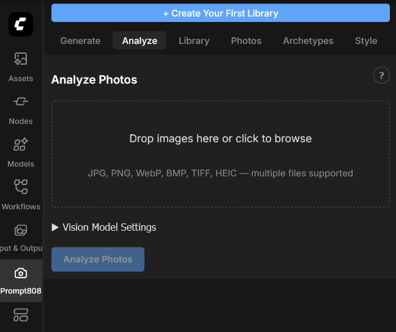
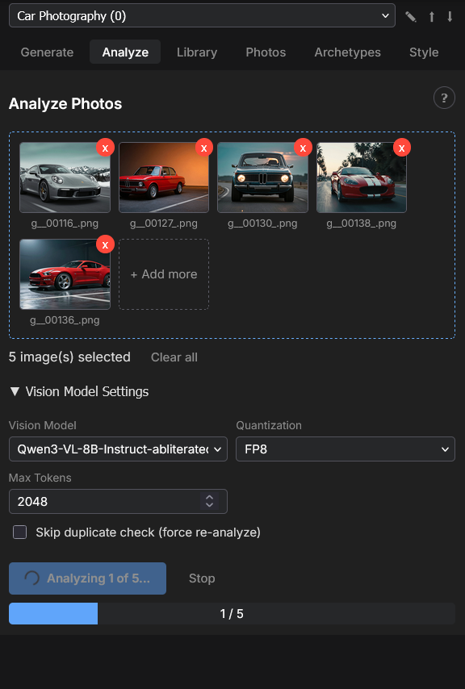
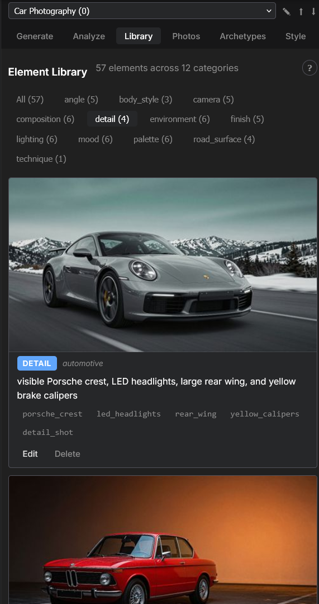
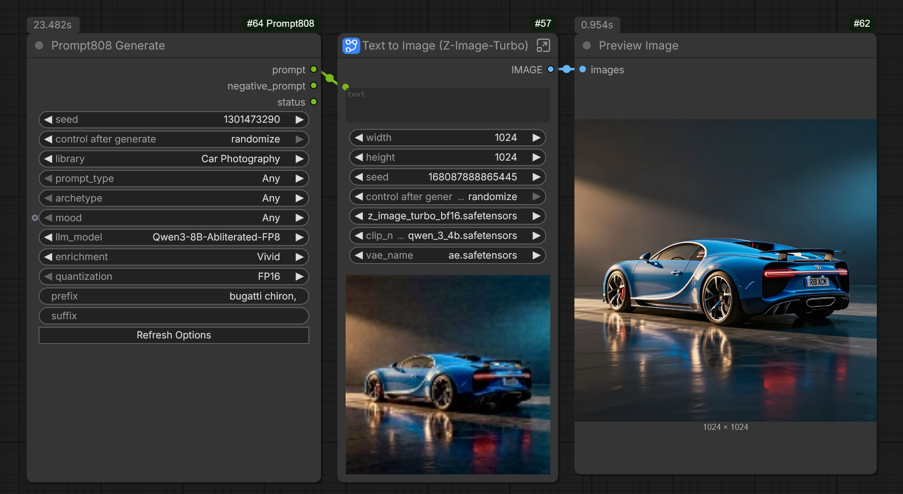

# Prompt808

**Vision-LLM prompt generation for ComfyUI** — analyze your images, build a personal style library, and generate prompts that match your aesthetic.

## What It Does

Prompt808 learns from your images. Drop in reference photos or artwork, and a vision model extracts the elements that define each image — lighting, composition, palette, mood, and more. Those elements become a growing library that Prompt808 draws from to generate prompts tailored to your visual style.

## Features

- **Learns from your images** — A vision model analyzes each upload and extracts structured scene elements into a growing library
- **Multiple prompt styles** — Cinematic, Fine Art, Fashion, Documentary, Portrait, Street, Architectural, and more
- **LLM-powered composition** — Natural-language prompts with seven enrichment levels from faithful reproduction to full creative freedom
- **Multi-library generation** — Combine elements from multiple libraries in a single generation using the Select Libraries node, or select "All" for every library at once
- **Library management** — Maintain separate libraries for different projects or genres, each fully isolated. Export and import libraries as `.p808` files for backup or sharing
- **ComfyUI native** — Sidebar panel for interactive use, plus a workflow node for automated generation
- **Medium-aware** — Automatically detects whether an image is a photograph, painting, illustration, or 3D render, and adjusts extraction accordingly

## Requirements

- ComfyUI (latest recommended)
- Python 3.10+
- CUDA GPU (8+ GB VRAM for analysis, 1+ GB for generation)

## Installation

Install as a ComfyUI custom node:

```bash
cd ComfyUI/custom_nodes
git clone <repo-url> Prompt808
pip install -r Prompt808/requirements.txt
```

Restart ComfyUI after installation.

## Quickstart

### 1. Create a library

Click the camera icon in ComfyUI's sidebar to open the Prompt808 panel. On first launch, click **"+ Create Your First Library"** and give it a name (e.g. "Portraits", "Landscapes"). The first library is automatically activated.



### 2. Analyze images

Navigate to the **Analyze** tab. Add images by:

- Drag and drop from your file manager
- Click to browse
- Drag images from a browser window
- Paste from clipboard (Ctrl+V)

Supported formats: JPG, PNG, WebP, BMP, TIFF, HEIC. Batch upload is supported — each image is processed sequentially with live progress.



### 3. Browse your library

The **Library** tab shows all extracted elements. Filter by category, edit descriptions and tags, or delete elements.

The **Photos** tab displays thumbnails of all analyzed images. Click a photo to see its extracted elements, or delete a photo to remove it with all associated data.



### 4. Generate prompts

Add a **Generate Prompt** node to your ComfyUI workflow. All generation settings are exposed as node inputs — library, style, mood, archetype, LLM model, enrichment, temperature, and more.



### 5. Manage libraries

Use the library dropdown and action buttons at the top of the sidebar to:

- **Switch** between libraries (each has its own elements, archetypes, style profiles, and dedup caches)
- **Create** new libraries with the **+** button
- **Rename** or **delete** libraries
- **Export** a library as a `.p808` file for backup or sharing
- **Import** one or more `.p808` files to add libraries from others

Libraries are fully isolated — the same image can exist in different libraries with different extracted elements.

### 6. Multi-library generation

To generate prompts that draw from multiple libraries at once:

- **Quick method** — Select **"All"** in the Generate Prompt node's library dropdown to use every library.
- **Fine-grained control** — Add a **Select Libraries** node. Each slot has a library dropdown and an on/off toggle. Click **"+ Add Library"** to add more slots. Connect its `libraries` output to the Generate Prompt node — the library dropdown auto-hides when connected.

When multiple libraries are selected, their elements, archetypes, and style profiles are merged into a virtual combined pool for generation.

## Models

### Vision Models (analysis)

| Model                            | VRAM    | Notes                                           |
| -------------------------------- | ------- | ----------------------------------------------- |
| Qwen3-VL-8B-Instruct             | ~12 GB  | Default, good quality                           |
| Qwen3-VL-8B-Instruct-abliterated | ~12 GB  | Abliterated variant for unrestricted extraction |
| Qwen3-VL-8B-Instruct-abliterated-v2 | ~12 GB | Alternative abliterated variant                |
| Qwen3-VL-8B-Instruct-FP8         | ~7.5 GB | Pre-quantized, good for 8 GB cards              |
| Qwen3-VL-8B-Thinking             | ~12 GB  | Chain-of-thought reasoning                      |
| Qwen3-VL-8B-Thinking-FP8         | ~7.5 GB | Thinking model, pre-quantized                   |
| Qwen3-VL-32B-Instruct            | ~28 GB  | Higher quality extraction                       |
| Qwen3-VL-32B-Instruct-FP8        | ~24 GB  | Pre-quantized 32B                               |
| Qwen3-VL-32B-Thinking            | ~28 GB  | Best quality, chain-of-thought                  |
| Qwen3-VL-32B-Thinking-FP8        | ~24 GB  | Thinking 32B, pre-quantized                     |

Vision models with non-standard tensor dimensions automatically fall back from FP8 to FP16 if block quantization is incompatible.

### Text Models (prompt enrichment)

| Model                    | VRAM (FP16) | VRAM (4-bit) | Notes                                           |
| ------------------------ | ----------- | ------------ | ----------------------------------------------- |
| Qwen3-0.6B               | 1.5 GB      | 0.7 GB       | Default, lightweight                            |
| Qwen3-1.7B               | 3.5 GB      | 1.3 GB       |                                                 |
| Qwen3-4B                 | 8.5 GB      | 2.8 GB       |                                                 |
| Qwen3-8B                 | 17 GB       | 5.5 GB       |                                                 |
| Qwen3-8B-Abliterated     | 17 GB       | 5.5 GB       | Abliterated for unrestricted output             |
| Qwen3-8B-Abliterated-v2  | 17 GB       | 5.5 GB       | Alternative abliterated variant                 |
| Qwen3-8B-Abliterated-FP8 | ~9 GB       | —            | Native FP8, abliterated for unrestricted output |
| Qwen3-32B                | 64 GB       | 18 GB        |                                                 |
| Qwen2.5-3B-Instruct      | 6 GB        | 2 GB         |                                                 |
| Qwen2.5-7B-Instruct      | 15 GB       | 5 GB         |                                                 |
| Qwen2.5-14B-Instruct     | 28 GB       | 8.5 GB       |                                                 |
| Qwen2.5-32B-Instruct     | 64 GB       | 18 GB        |                                                 |

FP8 variants of Qwen3 models (0.6B through 32B) are also available. Models are downloaded automatically from Hugging Face on first use.

### Enrichment Levels

| Level      | Fidelity | Creativity | Description                                                   |
| ---------- | -------- | ---------- | ------------------------------------------------------------- |
| Any        | —        | —          | Picks a random enrichment level per generation                |
| Baseline   | High     | Low        | Vivid photographic phrases, preserves original meaning        |
| Vivid      | High     | Low-Med    | Adds sensory and textural detail                              |
| Expressive | Medium   | Medium     | Evocative mood and atmosphere                                 |
| Poetic     | Low-Med  | High       | Metaphor, art references, heightened language                 |
| Lyrical    | Low      | High       | Original phrases inspired by tags only                        |
| Freeform   | Medium   | High       | Photoshoot director's instructions, grounded in scene context |

## Technical Documentation

See [PIPELINE.md](PIPELINE.md) for architecture, API reference, and technical details.

## Support the Project

Prompt808 is free and open source. If you find it useful, you can support its development: 

[](https://buymeacoffee.com/machete3000)

Coming soon... grab a pre-made library from [prompt808.com](https://prompt808.com) — ready-to-use element collections across a range of styles and genres, so you can start generating right away.
